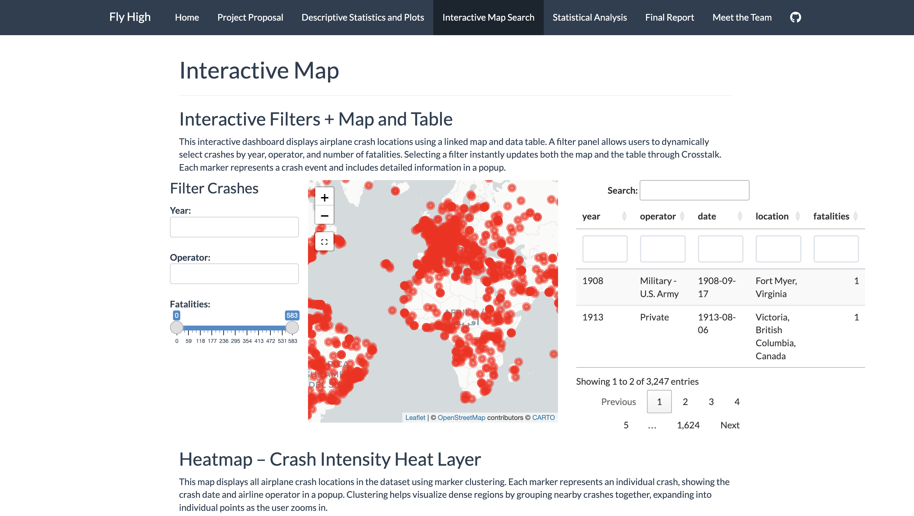
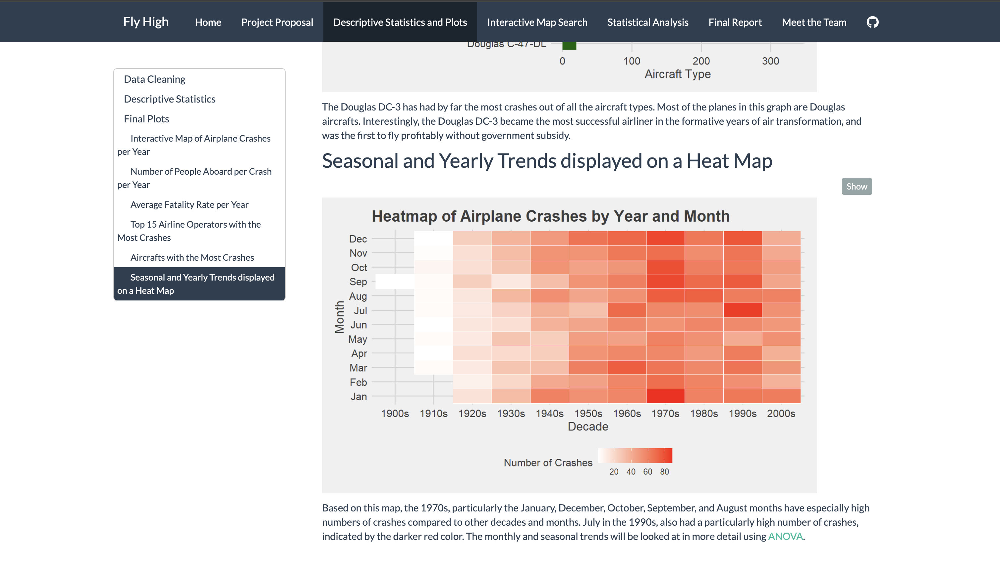

The project's aim is to understand the temporal context of aviation crash risk and understand patterns across aircraft, operators, and seasons.

```{=html}
<div style="display:flex; justify-content:center; gap:30px; flex-wrap:nowrap; margin: 20px 0;">

  <!-- First Image + Caption -->
  <div style="text-align:center; width:65%;">
    
    <p style="font-size:14px; color:#555; margin-top:6px;">Interactive Aviation Crash Dashboard </p>
  </div>
  
  <!-- Second Image + Caption -->
  <div style="text-align:center; width:65%;">
    
    <p style="font-size:14px; color:#555; margin-top:6px;">Aviation Crash Visualization</p>
  </div>

</div>
```
---

<a href="https://maya-rae.github.io/airplanedata.github.io/index.html" target="_blank">View the project's website here</a>

<a href="https://github.com/maya-rae/airplanedata.github.io" target="_blank">Learn more about the project by visiting the github page</a>

---

## Project Overview
This analysis explores aviation crash risk using historical crash data.  
The key objectives are to

*  Understand temporal trends in aviation accidents
* Identify risk patterns across aircraft types and operators  
* Examine seasonal and geographic patterns

## Highlights

* Interactive dashboards to explore crash risk over time  
* ANOVA and regression analyses to test factors affecting crashes  
* Clean visualizations for easier interpretation

---
