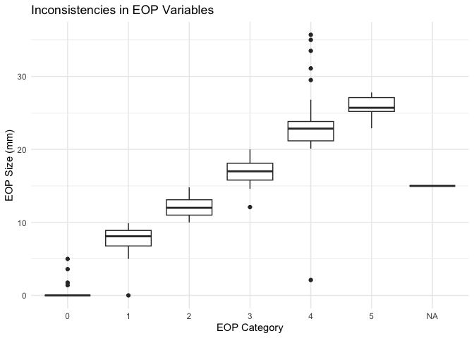
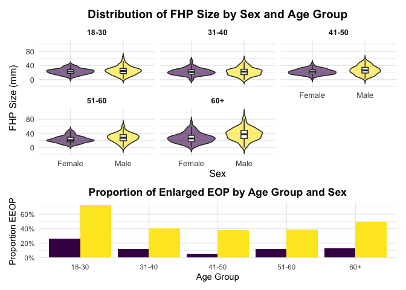
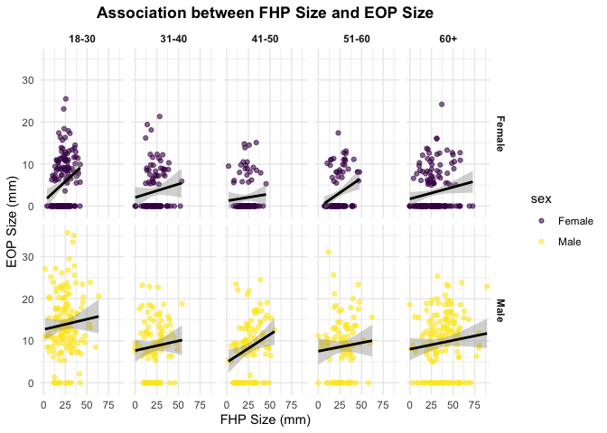

A Critical Review of Shaher & Sayers: Posture and Enlarged Protuberances
================

<h2 style="text-align:center;">

Maya Arnott
</h2>

<h3 style="text-align:center;">

October 22, 2025
</h3>

Shahar and Sayer’s paper examined 1,200 lateral cervical radiographs of
people aged 18 to 86. They measured the size of the external occipital
protuberance (EOP) to identify if it was enlarged (defined as the EEOP
\>10 mm) and examined how well factors like sex, age and forward head
protraction (FHP) predicted EEOP. The most surprising predictor found in
this study was age; they found an association between increased age and
a decrease in enthesophyte size. Here, we will investigate the validity
of their claims by reviewing the data.

``` r
# importing the dataset and doing initial tidying
exo_df = (
  read_excel("docs/data/p8105_mtp_data.xlsx", sheet = "this one", skip = 8) |>  
    janitor::clean_names() |> 
    rename(
      eop_size_category = eop_size
    ) |> 
    mutate( 
      eop_size_mm = replace_na (eop_size_mm, 0)
          )
)
```

``` r
age_map <- c(
  "1" = "0-17",
  "2" = "18-30",
  "3" = "31-40",
  "4" = "41-50",
  "5" = "51-60",
  "6" = "60+",
  "7" = "60+",
  "8" = "60+"
)

sex_map <- c("1" = "Male", "0" = "Female")

exo_df <- exo_df |> 
  mutate(
    # convert sex and age group
    sex = factor(recode(as.character(sex), !!!sex_map)),
    age_group = factor(recode(as.character(age_group), !!!age_map),
                       levels = c("18-30","31-40","41-50","51-60","60+"),
                       ordered = TRUE),
    
    # numeric transformations
    age = as.numeric(age),
    eop_size_mm = as.numeric(eop_size_mm),
    fhp_size_mm = as.numeric(fhp_size_mm),
    
    # factor transformations
    eop_size_category = factor(eop_size_category, levels = 0:5, ordered = TRUE),
    eop_visibility_classification = as.factor(eop_visibility_classification),
    eop_shape = as.factor(eop_shape),
    fhp_category = factor(fhp_category, levels = 0:max(fhp_category, na.rm = TRUE), ordered = TRUE)
  ) |> 
  # filter out 0-17 age group
  filter(!is.na(age_group))
```

``` r
sum_table <- exo_df |> 
  # calculates overall summary stats
  summarize(
    total_count = n(), 
    total_mean_age = mean(age, na.rm = TRUE),
    total_sd_age = sd(age, na.rm = TRUE),
    total_min_age = min(age, na.rm = TRUE),
    total_max_age = max(age, na.rm = TRUE)
  ) |> 
  # add a total row to aggregate the values
  mutate( sex = "Total") |> 
  select(sex, 
         count = total_count, 
         mean_age = total_mean_age, 
         sd_age = total_sd_age, 
         min_age = total_min_age, 
         max_age = total_max_age) |> 
  
  bind_rows(
    exo_df |> 
      # groups the stats by sex
      group_by(sex) |> 
      summarize(
        count = n(), 
        mean_age = mean(age, na.rm = TRUE),
        sd_age = sd(age, na.rm = TRUE),
        min_age = min(age, na.rm = TRUE),
        max_age = max(age, na.rm = TRUE),
        .groups = "drop"
      )
  ) |> 
  # compute % of participants by sex
  mutate(
    percent = round(count / sum(count) * 100, 1)) |> 
  select(
    sex, count, percent, mean_age, min_age, max_age)
```

First, we tidy the `exo_df` data by standardizing the names of columns.
Then, we replace the missing values in column `eop_size_mm` with 0, as
indicated in the header. `sex` was converted to a factor, and
`age_group`, `eop_size_category`, and `fhp_category` were all converted
to ordered factors to preserve the natural ranking of the groups. Key
variables represented in the dataset are `sex`, `age_group`,
`eop_size_mm` and its category ranking `eop_size_category`, and
`fhp_size_mm` and its category ranking `fhp_size_category`. There were
1219 participants included in the study, where 613 were women and 606
were men (Table 1). A review of the dataset revealed potential
inconsistencies between categorical variables and their continuous
counterparts. For the variable `eop_size_category`, the 4th categories’
EOP sizes ranged from 2.11mm to 35.7mm, which is inconsistent with the
intended ranges (Fig. 1).

``` r
kable(sum_table, format = "markdown")
```

| sex    | count | percent | mean_age | min_age | max_age |
|:-------|------:|--------:|---------:|--------:|--------:|
| Total  |  1219 |    50.0 | 45.53569 |      18 |      88 |
| Female |   613 |    25.1 | 45.68352 |      18 |      87 |
| Male   |   606 |    24.9 | 45.38614 |      18 |      88 |

**Table 1**

``` r
# checking issues btwn categorical and continuous versions

exo_df |> 
  group_by(age_group) |> 
  summarize(
    min_age = min(age, na.rm = TRUE),
    max_age = max(age, na.rm = TRUE)
  )
```

    ## # A tibble: 5 × 3
    ##   age_group min_age max_age
    ##   <ord>       <dbl>   <dbl>
    ## 1 18-30          18      30
    ## 2 31-40          31      40
    ## 3 41-50          41      50
    ## 4 51-60          51      60
    ## 5 60+            61      88

``` r
exo_df |> 
  group_by(eop_size_category) |> 
  summarize(
    mean_mm = mean(eop_size_mm, na.rm = TRUE),
    min_mm = min(eop_size_mm, na.rm = TRUE),
    max_mm = max(eop_size_mm, na.rm = TRUE)
  )
```

    ## # A tibble: 7 × 4
    ##   eop_size_category mean_mm min_mm max_mm
    ##   <ord>               <dbl>  <dbl>  <dbl>
    ## 1 0                  0.0226   0       5  
    ## 2 1                  7.75     0       9.9
    ## 3 2                 12.1     10      14.8
    ## 4 3                 17.0     12.1    20  
    ## 5 4                 23.2      2.11   35.7
    ## 6 5                 25.7     22.9    27.8
    ## 7 <NA>              15       15      15

``` r
exo_df |> 
  group_by(fhp_category) |> 
  summarize(
    mean_fhp = mean(fhp_size_mm, na.rm = TRUE),
    min_fhp = min(fhp_size_mm, na.rm = TRUE),
    max_fhp = max(fhp_size_mm, na.rm = TRUE)
  )
```

    ## # A tibble: 9 × 4
    ##   fhp_category mean_fhp min_fhp max_fhp
    ##   <ord>           <dbl>   <dbl>   <dbl>
    ## 1 0                5.94     0       9.8
    ## 2 1               15.6     10      33.8
    ## 3 2               24.8     20      31.8
    ## 4 3               34.2     30      39.9
    ## 5 4               46.0     40.1    89.3
    ## 6 5               55.2     50      59.8
    ## 7 6               64.5     60.1    68.9
    ## 8 7               76.0     70.5    79.9
    ## 9 <NA>            30.3     30.3    30.3

``` r
inconsistency_plot
```

<!-- -->

**Figure 1**

``` r
# create fhp plot

fhp_dist <- fhp_data |>
  ggplot(aes(x = sex, y = fhp_size_mm, fill = sex)) +
  geom_violin(trim = FALSE, alpha = 0.6) +
  geom_boxplot(width = 0.12, outlier.shape = NA, fill = "white") +
  facet_wrap(~ age_group, ncol = 3) +
  scale_fill_viridis_d(option = "D", alpha = 0.9) +
  labs(
    title = "Distribution of FHP Size by Sex and Age Group",
    x = "Sex",
    y = "FHP Size (mm)"
  ) +
  theme_minimal(base_size = 12) +
  theme(
    legend.position = "none",
    strip.text = element_text(face = "bold"),
    plot.title = element_text(face = "bold", hjust = 0.5)
  )
```

``` r
# create EEOP plot

eeop_dist <- eop_summary |> 
  ggplot(aes(
    x = age_group, y = prop_enlarged, fill = sex)) +
  geom_bar(
    stat = "identity", position = position_dodge()) + 
  scale_y_continuous(
    labels = scales::percent_format(accuracy = 1)) + 
  scale_fill_viridis_d(alpha = 1) +
  labs(
    title = "Proportion of Enlarged EOP by Age Group and Sex",
    x = "Age Group", y = "Proportion EEOP") + 
  theme_minimal() + 
  theme(legend.position = "none",
        plot.title = element_text(face = "bold", hjust = 0.5))

combined_plot <- fhp_dist / eeop_dist  +
  plot_layout(heights = c(2,1))
```

``` r
# combined plot
combined_plot
```

<!-- -->

**Figure 2**

``` r
# faceted scatter plot

scatterplot <- exo_df |> 
  ggplot(aes(
    x = fhp_size_mm, 
    y = eop_size_mm, 
    color = sex)) + 
  geom_point(alpha = 0.6) +
  geom_smooth(method = "lm", se = TRUE, color = "black") +
  scale_color_viridis_d(option = "D") +
  facet_grid(sex ~ age_group) +

  labs(
    title = "Association between FHP Size and EOP Size",
    x = "FHP Size (mm)",
    y = "EOP Size (mm)"
  ) + 
  theme_minimal() +
  theme(
    strip.text = element_text(face = "bold"),
    plot.title = element_text(face = "bold", hjust = 0.5)
  )
```

``` r
scatterplot
```

    ## `geom_smooth()` using formula = 'y ~ x'

<!-- -->

**Figure 3**

Consistent with Shaher & Sayers, Figure 2 shows that EEOPs are most
prevalent among younger males, with the greatest proportion observed in
the 18-30 year category. Median FHP size was slightly larger in males,
with greater overall variability than in females. Figure 3 indicates a
generally positive association between FHP and EOP sizes across most age
groups and sexes.

The author’s sample sizes in each age group were not fully consistent
with the data available. For instance, the paper states that the
18-30-year group included 300 participants, whereas this dataset
contains 303 individuals in that category. The mean FHP in the male
cases was 28.5 ± 14.7 mm, consistent with the author’s findings.
Similarly, the mean FHP among females was 23.7 ± 10.6 mm. EEOP is
defined by Shaher and Sayers as an EOP exceeding 10 mm in size. Using
the corresponding variable `eop_size_category`, EEOP was defined defined
as `eop_size_category >= 2.` Using this criteria, the prevalence of EEOP
was 32.3, closely aligning with the reported value of 33% in the
original study.

``` r
fhp_data |> 
  summarize(
    mean_fhp = mean(fhp_size_mm, na.rm = TRUE),
    sd_fhp   = sd(fhp_size_mm, na.rm = TRUE)
  )
```

    ## # A tibble: 1 × 2
    ##   mean_fhp sd_fhp
    ##      <dbl>  <dbl>
    ## 1     26.1   13.0

``` r
fhp_data |> 
  group_by(sex) |> 
  summarize(
    mean_fhp = mean(fhp_size_mm, na.rm = TRUE),
    sd_fhp   = sd(fhp_size_mm, na.rm = TRUE),
    n        = n()
  )
```

    ## # A tibble: 2 × 4
    ##   sex    mean_fhp sd_fhp     n
    ##   <fct>     <dbl>  <dbl> <int>
    ## 1 Female     23.7   10.6   611
    ## 2 Male       28.5   14.7   602

``` r
exo_df |> 
  summarize(
    prevalence_enlarged_eop = mean(eop_size_category >= 2, na.rm = TRUE)
  )
```

    ## # A tibble: 1 × 1
    ##   prevalence_enlarged_eop
    ##                     <dbl>
    ## 1                   0.323

``` r
exo_df |>
  filter(age_group == "60+", !is.na(fhp_size_mm)) |>
  summarize(
    percent_over_40 = mean(fhp_size_mm > 40) * 100
  )
```

    ## # A tibble: 1 × 1
    ##   percent_over_40
    ##             <dbl>
    ## 1            32.6

The percentage of participants aged 60+ with FHP greater than 40 mm was
calculated as 32.6%, slightly smaller than the report’s 34.5%. My
findings support the authors’ observation that males tend to exhibit
more robust cranial traits; however, there is insufficient evidence to
conclude that cell phone use causes horn growth. Given the
retrospective, cross-sectional nature of the data, establishing such a
link would require longitudinal and behavioral measures of posture and
device usage.
