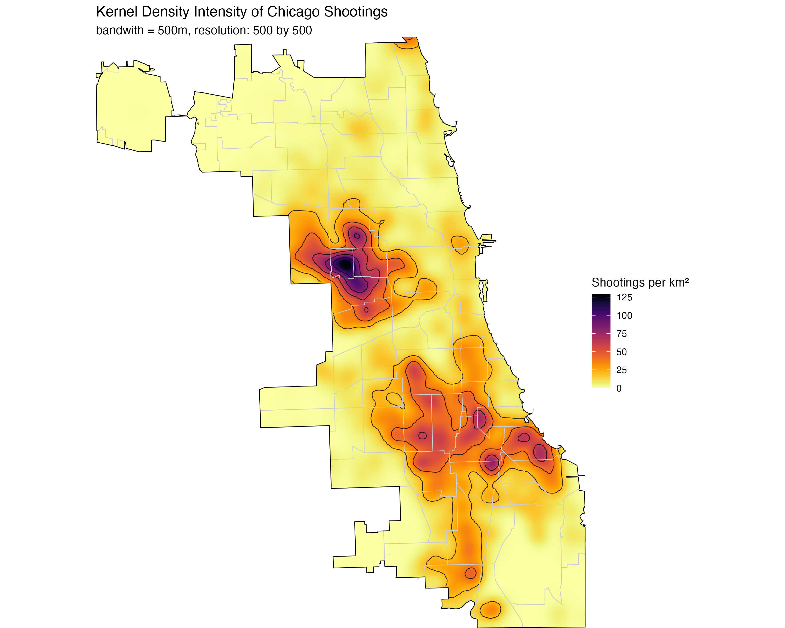
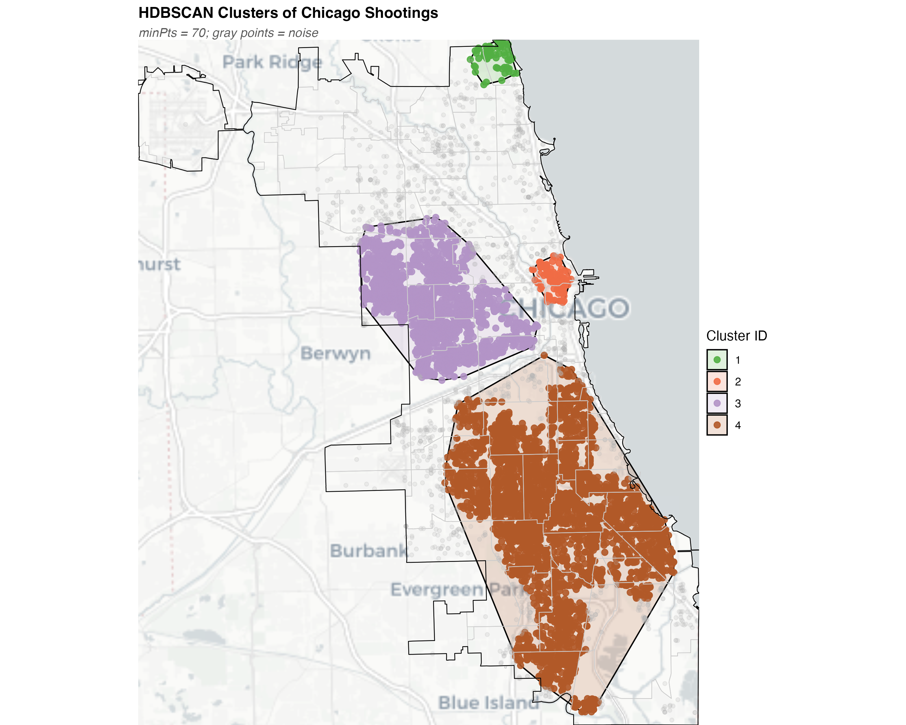
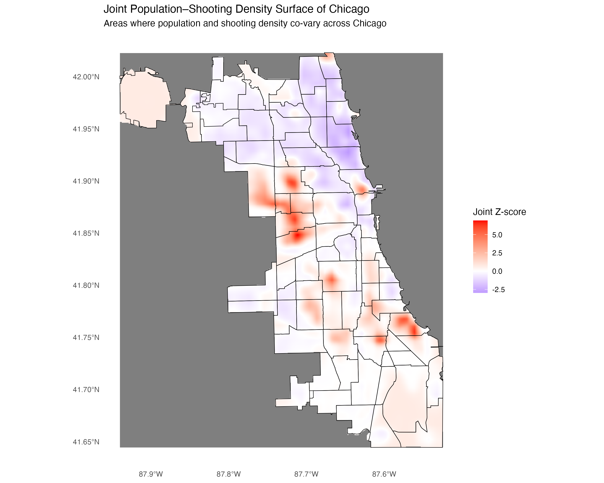
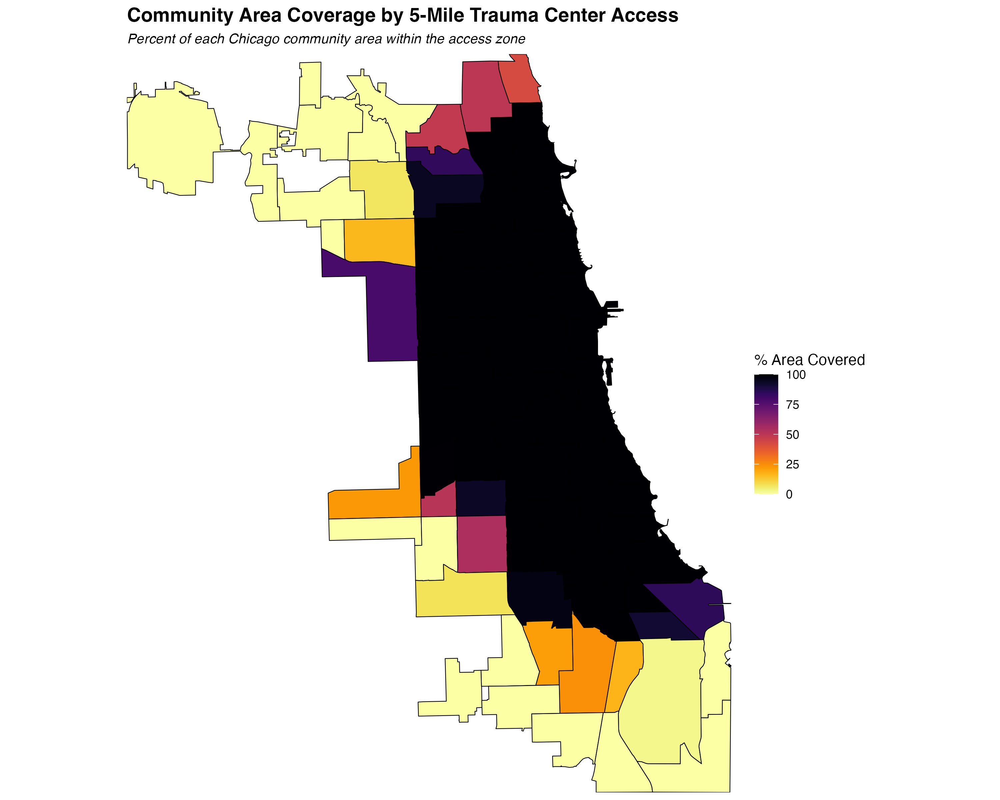
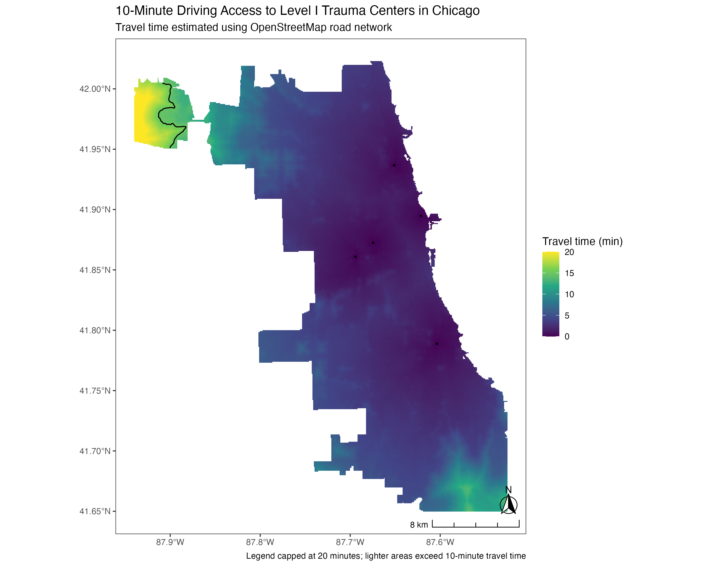
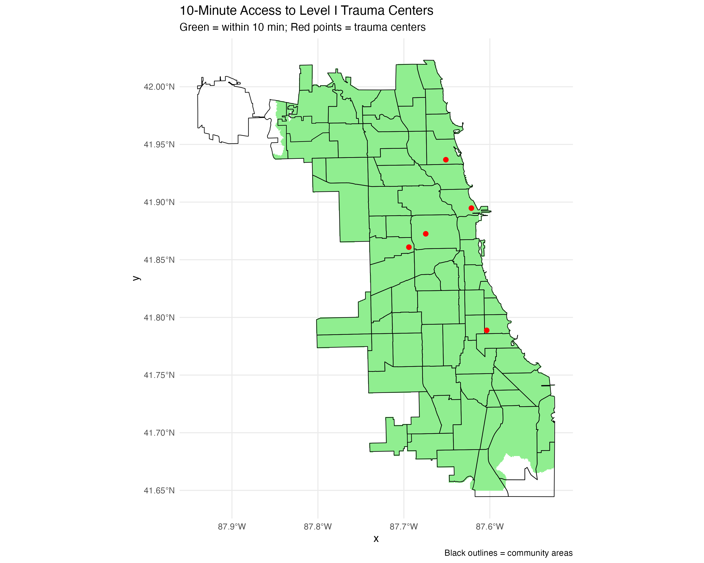
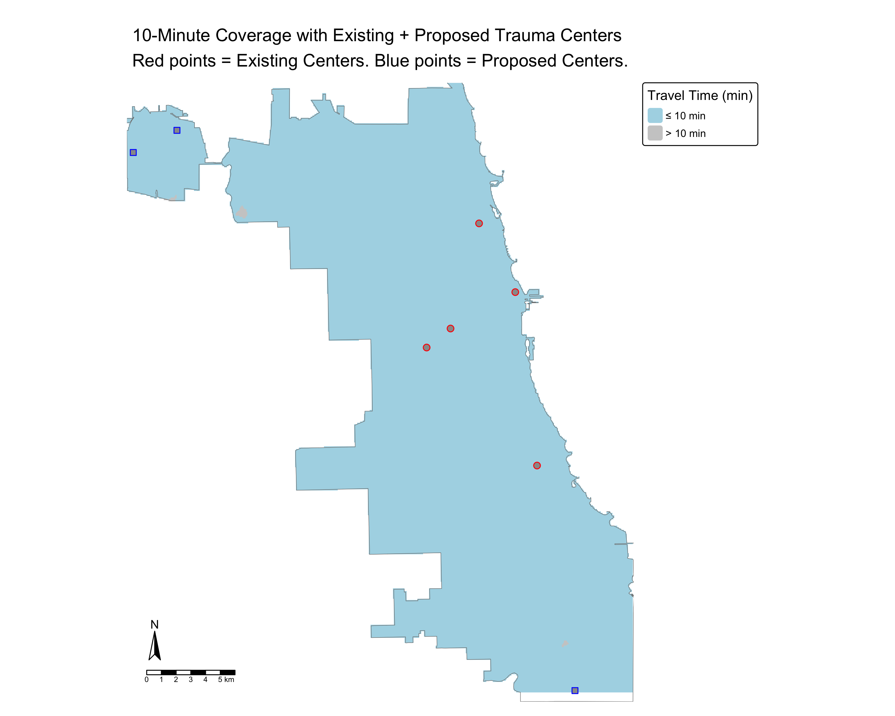
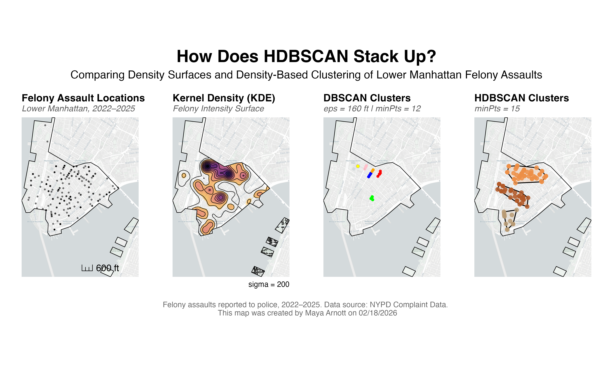
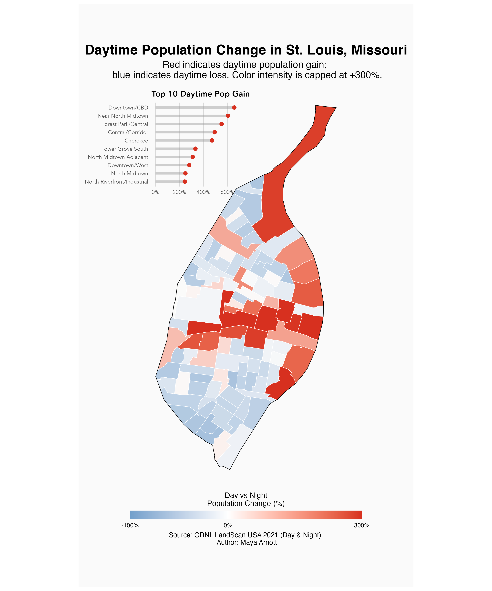
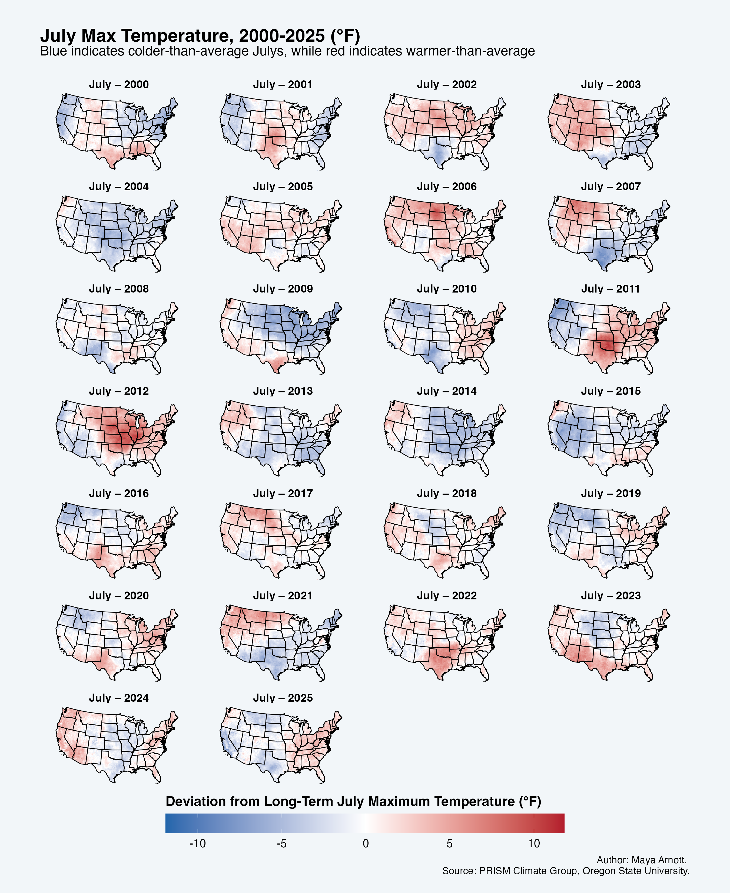

## About This Portfolio  

This page showcases my GIS and spatial analysis projects using R, focusing on spatial epidemiology, accessibility modeling, and geospatial data science.

---

## 🏥 Gun Violence & Access to Trauma Care — Chicago

### Overview
This project examines the spatial distribution of shootings in Chicago and evaluates how access to Level I trauma centers aligns with population and violent incidents. Using point-level crime data, I applied spatial point pattern analysis (Ripley’s K, KDE, HDBSCAN) to identify clusters at street and neighborhood scales. Raster-based analyses combined population density with shooting intensity to model demand-weighted access to trauma care. The project identifies areas where violent incidents and population density are not well served by existing trauma centers. This project highlights opportunities to optimize emergency care allocation.

### Methods used:
- Ripley's K function
- Kernel density estimation
- HDBSCAN clustering
- Raster analyses
- Travel-time accessibility analysis

### Tools used:
- R
- sf
- terra
- spatstat
- dbscan
- tmap/ggplot2

---

### Spatial Patterns of Gun Violence


```{=html}
<div style="display:grid; grid-template-columns: 1fr 1fr; gap:15px;">
  
  
</div>
```


<p style="text-align:center; font-size:14px;">
Left: Kernel density estimate of shooting intensity. Right: HDBSCAN clustering of shooting incidents.
</p>

---

### Raster & Accessibility Analysis

```{=html}
<div style="display:grid; grid-template-columns: 1fr 1fr; gap:15px;">
  
  
</div>
```

<p style="text-align:center; font-size:14px;">
Left: Combined raster of population and shooting density. Right: Community-level accessibility patterns.
</p>

---

### Travel Time to Trauma Centers

```{=html}
<div style="display:grid; grid-template-columns: 1fr 1fr; gap:15px;">
  
  
</div>
```

<p style="text-align:center; font-size:14px;">
Left: Continuous travel time surface. Right: Areas within 10-minute access to Level I trauma centers.
</p>

---

### Trauma Center Locations



<p style="text-align:center; font-size:14px;">
Locations of Level I trauma centers across Chicago.
</p>

# 📍 Identifying Hotspots: DBSCAN vs. HDBSCAN

## Overview
This project examines the spatial structure of reported felony assaults in Lower Manhattan, New York City. Using point-level crime data, the analysis evaluates how incidents are distributed across the neighborhood and compares how different analytical methods — kernel density estimation (KDE), DBSCAN, and HDBSCAN clustering — characterize spatial concentration. The data from NYC Open Crime Data was filtered to include felony assaults occurring between 2022 and 2025. The resulting maps highlight areas of high crime density and illustrate how parameter choices influence the detection of clusters and noise, providing insight into the local geographic patterns of felony assaults.

## Tools used:
- R
- sf
- spatstat
- KDE, DBSCAN, & HDBSCAN
- ggplot2
  

---

# 🌆 Daytime Population Change — St. Louis

## Overview

This project analyzes daytime population change in St. Louis, Missouri to examine how population distribution shifts between nighttime residential patterns and daytime activity centers. Using global population rasters from LandScan Global, daytime and nighttime population counts were aggregated to neighborhood boundaries and used to calculate percent daytime population change. The resulting map highlights that the Downtown Central Business District and North Midtown neighborhood experience the greatest daytime population gain, reflecting employment centers and major activity hubs within the city.

## Tools used:
- R
- sf
- terra
- tmap


---

# 🌡 U.S. Temperature Anomalies

## Overview
This map shows how July maximum temperatures have deviated from their long-term averages across the U.S. over the past 25 years. Using PRISM Climate data from Oregon State University, I created a faceted map of the U.S. over the past 25 years. 

## Tools used:  
- R
- sf
- terra
- PRISM Climate Data


---

# 🐆 Recommendations for Mammal Conservation —  Africa

<iframe src="files/Arnott-Map.pdf" width="100%" height="800px"></iframe>
